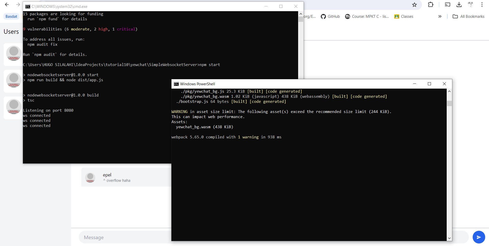

# Tutorial 10

### 3.1. Original code

### 3.2 Add some creativities to the webclient

Saya mengubah foto avatar menjadi shape dicebear yang digenerate berbeda-beda untuk tiap client. Selain itu, box daftar client di sebelah kiri saya ubah backgroundnya menjadi warna kuning. Box area chat juga saya ubah sedikit, backgroundnya menjadi warna biru muda, dan bubble chat nya menjadi transparan sehingga yang terlihat hanya username dan pesan client.